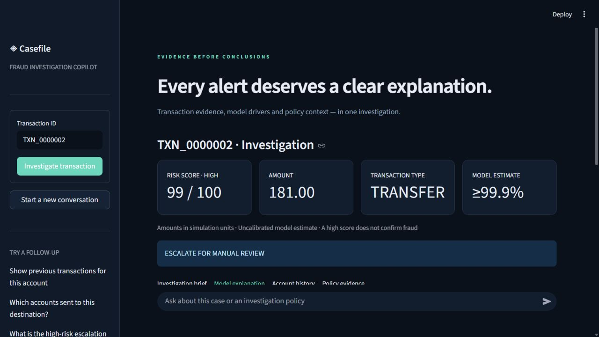
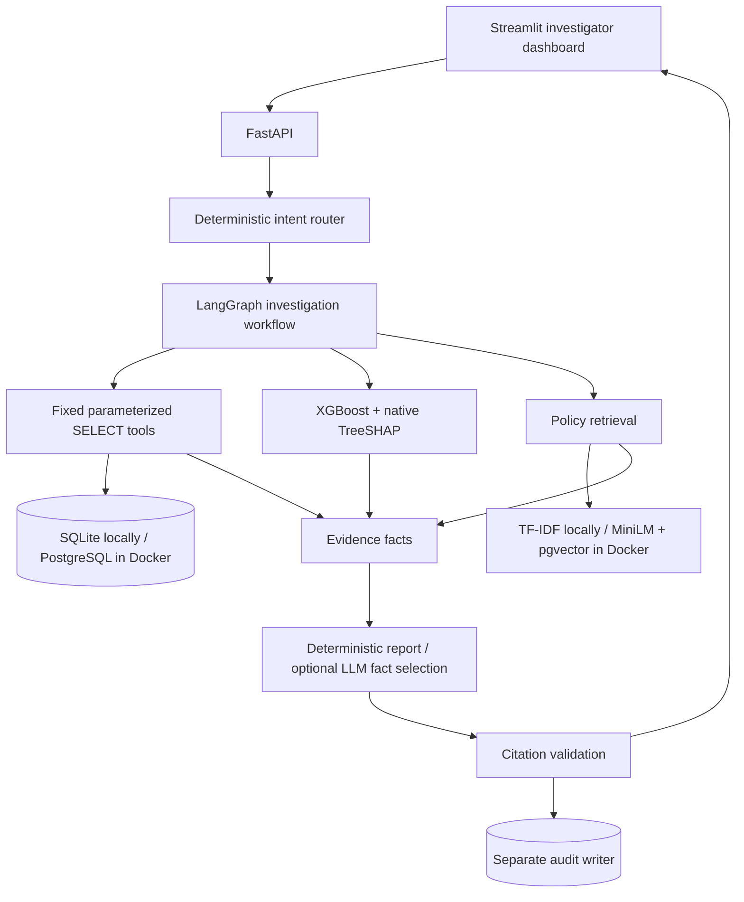

# Fraud Investigation RAG Copilot

**Evidence-based transaction investigation with explainable machine learning and retrieval-augmented policy analysis.**

Python · FastAPI · Streamlit · LangGraph · XGBoost · TreeSHAP · PostgreSQL / pgvector

[Quick start](#quick-start--windows) · [Example questions](#example-questions) · [Architecture](#architecture) · [Evaluation](#evaluation-and-tests) · [API guide](docs/API.md) · [Contributing](CONTRIBUTING.md)

Investigate a PaySim transaction with database evidence, XGBoost risk, TreeSHAP explanations and cited investigation policies. The service saves a structured case report and remembers the selected transaction for follow-up questions.

**Try:** `Investigate TXN_0000002`, then `Show previous transactions for this account`.



## The problem

Investigating a fraud alert usually requires switching between transaction records, model scores, account history and policy documents. This copilot brings those sources into one auditable report, showing both the evidence and what it cannot establish.

**Project status:** working local portfolio application. The core test suite and local retrieval modes have been verified. PostgreSQL/Docker and live OpenAI calls still require integration verification. This is an analyst-support demonstration, not a production fraud decision system.

## Example questions

Start with a transaction, then ask follow-up questions in the same conversation:

1. **Investigate TXN_0000002**
2. **Show previous transactions for this account**
3. **Which accounts sent to this destination?**
4. **What is the high-risk escalation policy?**

Other supported questions include `What is the score for TXN_0000002?`, `Calculate transaction velocity`, `Show similar transactions`, and `What does SHAP mean?`. The copilot cannot determine account-holder identity, KYC status, sanctions status or criminal intent from PaySim.

## Architecture



The investigation graph follows six explicit stages: transaction → prior history → risk and SHAP → policies → report → evidence validation. The router also supports direct transaction, score, policy, history, velocity, counterparty and similar-transaction requests.

## Quick start · Windows

Clone the repository and run with Python 3.10 or 3.11. The generated demo requires no dataset download or API key:

```powershell
git clone https://github.com/Sanchay20Shukla/fraud-investigation-copilot.git
cd fraud-investigation-copilot
python -m venv .venv
.venv/Scripts/python.exe -m pip install -r requirements.txt
.venv/Scripts/python.exe -m scripts.bootstrap --demo
./scripts/run-local.ps1
```

Open the [dashboard](http://127.0.0.1:8510) or [interactive API docs](http://127.0.0.1:8010/docs).

The demo creates synthetic educational transactions, trains a model and indexes the policy documents. Its labels are generated from simple rules; demo metrics are not evidence of real fraud-detection performance. Raw datasets, local databases, environments and generated models are excluded from Git. Bootstrap creates the artifacts needed to run the application.

To reproduce the reported PaySim experiment, use a fresh database, place your own PaySim CSV at `data/raw/paysim.csv`, and replace the bootstrap command with:

```powershell
.venv/Scripts/python.exe -m scripts.bootstrap --paysim data/raw/paysim.csv --limit 200000
```

See the [data guide](data/README.md) for required columns, ID conventions and dataset handling.

For explicit foreground processes, use two terminals:

```powershell
.venv/Scripts/python.exe -m uvicorn api.main:app --host 127.0.0.1 --port 8010
.venv/Scripts/python.exe -m streamlit run dashboard/app.py --server.address 127.0.0.1 --server.port 8510
```

On Linux/macOS, activate `.venv/bin/activate` and use `python` for the same commands. If no PaySim file is available, use `python -m scripts.bootstrap --demo` to generate explicitly synthetic educational fixtures. Fixture metrics are not a fraud benchmark.

Bootstrap reuses a populated database and retrains/reindexes it. It refuses to append another source to an existing dataset. To use a different dataset, configure a fresh database and artifact directory. `--limit 0` imports the complete CSV; training currently loads the imported rows into memory, so full-PaySim training requires substantially more RAM.

## What is implemented

| Area | Implementation |
|---|---|
| Data | Chunked, atomic PaySim ingestion; finite-value validation; zero-based stable transaction IDs; dataset manifest |
| Model | Chronological train/validation/test splits; XGBoost; validation-selected decision threshold; precision, recall, F1, PR-AUC, ROC-AUC |
| Explanation | Exact native TreeSHAP with all signed contributions, baseline and log-odds units |
| Knowledge | Six clearly synthetic Markdown policies, section-aware LangChain chunking, source IDs and SHA-256 hashes |
| Retrieval | Credential-free TF-IDF cosine baseline; optional MiniLM embeddings; PostgreSQL pgvector search in semantic mode |
| Investigation | Deterministic LangGraph workflow, cited report, saved predictions/reports and workflow trace |
| Conversation | Persisted transaction context; prior origin history, counterparty transactions, 24-step velocity and amount/type similarity |
| API/UI | FastAPI routes, Streamlit chat, score cards, SHAP chart, history tables, policy excerpts and JSON download |
| Security | No arbitrary SQL tool; read-only query engine; separate PostgreSQL read/audit privileges; labels excluded from tools |
| Evaluation | 50 authored cases, document-source recall/precision, reciprocal rank and router accuracy; tests and GitHub Actions |

## Dataset and model interpretation

Transaction IDs are `TXN_` plus the zero-based source row padded to seven digits. IDs such as `TXN_10482` are rejected; use `TXN_0010482`. The `step` is simulation time, not a fabricated calendar timestamp. Amounts have unspecified simulation currency units, so the interface does not invent an INR denomination.

Fraud labels live in `training_labels`, separate from the analyst transaction table. Features include balances, amount-to-balance ratio, type, balance deltas, depletion and direction-aware origin reconciliation error. These are **post-transaction features**; this model is not suitable for pre-authorization scoring. Some PaySim balances are zero or incomplete by construction, so reconciliation errors do not establish fraud.

All rows in the same time step remain in one split. Prior-history queries exclude the entire current step, since intra-step event ordering is unknown. History is limited to imported data and display queries are capped at 50–100 rows. Similarity is a descriptive type/amount filter, not a second fraud classifier.

Model probabilities are uncalibrated. Report scores use integer `probability × 100`. Synthetic policy bands are HIGH ≥80, MEDIUM ≥50 and LOW <50. The validation-selected classification threshold used in model metrics is separate from these operational review bands. No recommendation automatically approves, blocks or freezes a transaction/account.

### Measured local model results

The first 200,000 source rows were loaded. Training used steps 1–9 (72,726 rows, 109 fraud labels); validation used steps 10–11 (73,232 rows, 18 fraud labels); the holdout used steps 12–13 (54,042 rows, **20 fraud labels**).

| Holdout metric | Value |
|---|---:|
| Precision | 0.9474 |
| Recall | 0.9000 |
| F1 | 0.9231 |
| PR-AUC / average precision | 0.9087 |
| ROC-AUC | 0.9969 |

Threshold selected on validation: 0.95. The holdout has few positive cases, so these results have substantial uncertainty and do not represent full-PaySim or real-world performance. See `reports/model_metrics.json` for the exact artifact version, splits and confusion matrix. Reproduce with the bootstrap command above.

## Semantic retrieval

Default local mode is **lexical retrieval**, clearly identified in the readiness endpoint and evaluation output. It does not claim semantic understanding. To enable local embeddings:

```powershell
.venv/Scripts/python.exe -m pip install -r requirements-semantic.txt
# Copy .env.example to .env; set RETRIEVAL_MODE=semantic.
.venv/Scripts/python.exe -m scripts.index_policies
```

The first semantic run downloads `sentence-transformers/all-MiniLM-L6-v2`. SQLite mode uses a local embedding matrix; PostgreSQL mode stores 384-dimensional vectors and searches with pgvector cosine distance. Restart the API after changing configuration, model or index. Do not load untrusted `.joblib` artifacts. Local MiniLM indexing and evaluation have been verified.

The six Markdown documents are intentionally editable, synthetic examples. Citations identify source filename, section, chunk ID and digest; there are no invented PDF page numbers. Reindex after editing policies. Review-band logic lives in `src/agents/report.py` and must be changed and tested together with policy text.

## Optional OpenAI integration

The application works without an API key. To enable LLM-assisted selection of report facts, set these in `.env`:

```dotenv
LLM_ENABLED=true
OPENAI_API_KEY=your_key
OPENAI_MODEL=your_structured_outputs_capable_model
```

The Responses API returns structured evidence IDs. Application code resolves IDs back to precomputed facts; the LLM cannot write new fraud claims, modify risk scores, choose recommendations or execute SQL. Invalid IDs, refusals and provider failures fall back to deterministic output with a visible warning. The report states its generation mode. This is deliberately constrained, extractive assistance rather than freeform LLM authorship.

When enabled, the precomputed investigation facts (including transaction ID, amount, score and observed indicators) are sent to the configured OpenAI account. `store=False` is set on requests. LLM mode is off by default and does not affect policy retrieval. Live provider behavior requires your own credentials and has not been exercised during local setup.

## PostgreSQL + pgvector + Docker

```bash
docker compose up --build
```

Compose starts PostgreSQL with pgvector, a one-shot initialization/training/indexing job, FastAPI and Streamlit. It uses generated **synthetic demo data** by default so it can start without a private dataset. The setup job downloads the MiniLM model. First startup includes dependency downloads and training.

To use PaySim, place your CSV at `data/raw/paysim.csv` and change the setup command to:

```yaml
command: ["sh", "-c", "python -m scripts.bootstrap --paysim data/raw/paysim.csv --limit 200000 && python -m scripts.grant_roles"]
```

Select the data source before the first initialization. Existing populated volumes are retained on subsequent starts. Database and artifact volumes are separate from the local SQLite build.

Ports bind to localhost only: database 5433, API 8010, dashboard 8510. Compose credentials are explicit **local demo credentials**. The API container receives reader and audit credentials; it does not receive the database-owner password. The reader has SELECT privileges on transaction/policy data, not labels. The audit role can insert reports/predictions and upsert conversation context. Initialization owns schema creation and training.

Container startup and PostgreSQL integration have not yet been verified in the recorded build environment. For public deployment, first add authentication, analyst-level authorization, session ownership, TLS, secrets management, retention controls and operational monitoring. This project is designed for a local single-user demonstration; making the source repository public does not deploy the application.

## API

| Method | Route | Purpose |
|---|---|---|
| GET | `/health` | Process liveness |
| GET | `/ready` | Model/index initialization and transaction count |
| GET | `/transactions/{transaction_id}` | Transaction without labels |
| POST | `/investigate` | Generate and persist a report |
| POST | `/chat` | Routed question with optional UUID session token |
| GET | `/investigations/{investigation_id}` | Retrieve saved report |

```json
{"transaction_id": "TXN_0000002"}
```

Chat request:

```json
{"question": "Investigate TXN_0000002"}
```

Reuse the returned `session_id` in a follow-up request. Session context survives restarts. Tokens provide separation for the demo; they are not a substitute for authentication or user ownership checks. Missing IDs return 404, malformed requests return 400/422. Reports use UUIDs and retain the full evidence snapshot.

## Evaluation and tests

```powershell
.venv/Scripts/python.exe -m pytest -q
.venv/Scripts/python.exe -m src.evaluation.rag_evaluation
```

The evaluation set includes 35 policy questions, including multi-document cases, and 15 routing/unsupported cases.

| Retrieval mode | Source recall@5 | Source precision@5 | Mean reciprocal rank | Router accuracy |
|---|---:|---:|---:|---:|
| TF-IDF lexical | 1.0000 | 0.6143 | 0.9343 | 1.0000 |
| MiniLM semantic | 0.9286 | 0.4257 | 0.8476 | 1.0000 |

The local default remains lexical because it performed better on this small corpus. These are measurements on an authored development set, not independently held-out evidence of generalization. The output explicitly lists unmeasured LLM faithfulness, answer relevancy and RAGAS context metrics. No invented before/after improvements are claimed. Exact outputs are in `reports/retrieval_metrics.json` and `reports/semantic_retrieval_metrics.json`.

The local core suite passes **36 tests**. Tests use an isolated synthetic database/model and exercise ingestion rollback, label exclusion, time boundaries, SHAP additivity, actual SQLite write denial, report persistence, citations, missing policy abstention, session isolation, unsupported requests, API behavior and mocked LLM evidence selection/fallbacks. Live OpenAI and Docker still require separate integration checks. Exact tested direct dependency versions are in `requirements-tested.txt`.

## Repository map

```text
api/                 FastAPI service
dashboard/           Streamlit investigator workspace
documents/           Six synthetic policies and procedures
evaluation/          50 authored gold-source and routing cases
src/ingestion/       PaySim validation, chunking and embeddings
src/models/          Features, XGBoost training and TreeSHAP
src/retrieval/       Lexical / semantic / pgvector retrieval
src/tools/           Fixed SQL, model and policy interfaces
src/agents/          Router, LangGraph workflow and report validation
src/evaluation/      Reproducible retrieval evaluation
scripts/             Bootstrap, indexing, role grants and local launcher
sql/                 PostgreSQL role initialization
tests/               Isolated unit and integration tests
reports/             Actual measured results and sample investigation
data/processed/      Ignored local transaction database and manifest
models/              Ignored generated model/index artifacts
```

## Next improvements

Calibrate probabilities on a separate validation slice, evaluate the full dataset with a larger later-time fraud sample, expand independent retrieval and adversarial test sets, add reranking and answer-level evaluation, support versioned policy rule ingestion, and add authenticated multi-user case management. No Kubernetes, Kafka or external agent swarm is needed for this version.

## Documentation

- [API requests and example responses](docs/API.md)
- [Dataset preparation and artifact handling](data/README.md)
- [Model and retrieval evaluation notes](reports/README.md)
- [Contribution workflow](CONTRIBUTING.md)

The measured reports and screenshot are checked in for review. They describe a recorded experiment; rerunning on generated demo data produces different metrics.

## Implementation references

- [LangGraph graph API](https://docs.langchain.com/oss/python/langgraph/graph-api)
- [pgvector SQLAlchemy integration](https://github.com/pgvector/pgvector-python)
- [XGBoost prediction and native SHAP contributions](https://xgboost.readthedocs.io/en/latest/python/python_api.html)
- [OpenAI Structured Outputs](https://developers.openai.com/api/docs/guides/structured-outputs)
